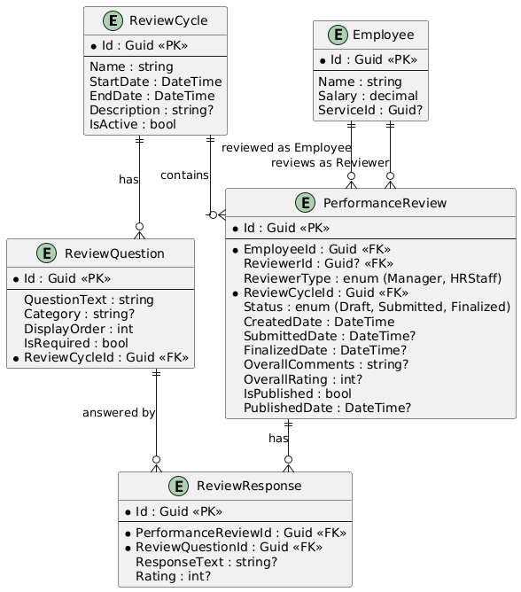
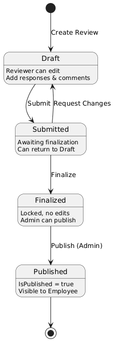

# Performance Review Lifecycle Documentation

## Data Model

### Entity Relationship Diagram



### Model Classes

#### 1. ReviewCycle

Represents a review period (e.g., Q1 2026, Annual 2026).

| Property    | Type     | Description                                |
|-------------|----------|--------------------------------------------|
| Id          | Guid     | Primary key                                |
| Name        | string   | Name of the cycle (e.g., "Q1 2026 Review") |
| StartDate   | DateTime | Start date of the review period            |
| EndDate     | DateTime | End date of the review period              |
| Description | string?  | Optional description                       |
| IsActive    | bool     | Whether this cycle is currently active     |

#### 2. ReviewQuestion

Represents a question in a performance review.

| Property      | Type    | Description                                          |
|---------------|---------|------------------------------------------------------|
| Id            | Guid    | Primary key                                          |
| QuestionText  | string  | The question text                                    |
| Category      | string? | Category (e.g., "Communication", "Technical Skills") |
| DisplayOrder  | int     | Order in which to display the question               |
| IsRequired    | bool    | Whether this question must be answered               |
| ReviewCycleId | Guid    | Foreign key to ReviewCycle                           |

#### 3. PerformanceReview

Represents a performance review for an employee.

| Property        | Type         | Description                                     |
|-----------------|--------------|-------------------------------------------------|
| Id              | Guid         | Primary key                                     |
| EmployeeId      | Guid         | Employee being reviewed                         |
| ReviewerId      | Guid?        | Reviewer conducting the review (Manager or HR)  |
| ReviewerType    | ReviewerType | Type of reviewer (Manager or HRStaff)           |
| ReviewCycleId   | Guid         | Foreign key to ReviewCycle                      |
| Status          | ReviewStatus | Current status (Draft/Submitted/Finalized)      |
| CreatedDate     | DateTime     | When the review was created                     |
| SubmittedDate   | DateTime?    | When the review was submitted                   |
| FinalizedDate   | DateTime?    | When the review was finalized                   |
| OverallComments | string?      | Reviewer's overall comments                     |
| OverallRating   | int?         | Overall rating (1-5 scale)                      |
| IsPublished     | bool         | Whether the review is visible to the employee   |
| PublishedDate   | DateTime?    | When the review was published                   |

#### 4. ReviewResponse

Represents a response to a review question.

| Property            | Type    | Description                      |
|---------------------|---------|----------------------------------|
| Id                  | Guid    | Primary key                      |
| PerformanceReviewId | Guid    | Foreign key to PerformanceReview |
| ReviewQuestionId    | Guid    | Foreign key to ReviewQuestion    |
| ResponseText        | string? | Text response                    |
| Rating              | int?    | Rating for this question (1-5)   |

#### 5. ReviewStatus (Enum)

```csharp
public enum ReviewStatus
{
    // Review is being prepared
    Draft = 0,
    // Review has been submitted for approval
    Submitted = 1,
    // Review is complete and locked
    Finalized = 2
}
```

#### 6. ReviewerType (Enum)

```csharp
public enum ReviewerType
{
    // Review conducted by employee's manager
    Manager = 0,
    // Review conducted by HR staff
    HRStaff = 1
}
```

## Review Lifecycle

### State Diagram



### Lifecycle Stages

#### 1. Draft

- Initial state when a review is created
- Allowed Actions:
    - Edit review responses
    - Add/modify overall comments and rating
    - Submit for approval
- Who Can Edit: 
  - Manager
  - HR Staff (reviewer)

#### 2. Submitted

- Review has been submitted and is awaiting finalization
- Allowed Actions:
    - View review details
    - Return to Draft (if changes needed)
    - Finalize the review
- Who Can Edit: 
  - Manager
  - HR Admin

#### 3. Finalized

- Review is complete and locked
- Allowed Actions:
    - View only (no edits allowed)
    - Publish to employee (Admin only)
- Who Can View:
  - Employee (only after published)
  - Manager
  - HR Admin

#### 4. Published

- Review has been published and is visible to the employee
- Allowed Actions:
    - View only (no edits allowed)
- Who Can View:
  - Employee
  - Manager
  - HR Admin
- Note:
  - `IsPublished = true` and `PublishedDate` is set

### Workflow Steps

1. **Create Review Cycle**
    - HR Admin creates a new review cycle with start/end dates
    - Add review questions to the cycle

2. **Initiate Reviews**
    - System or HR Admin creates PerformanceReview records for each employee
    - Reviews start in Draft status

3. **Complete Review**
    - Manager answers all required questions
    - Manager provides overall rating and comments
    - Manager submits the review

4. **Finalize Review**
    - HR Admin or Manager finalizes the review
    - Review becomes read-only
    - Employee can view their completed review

## Database Tables

The following tables are created by the migration:

- `ReviewCycles` - Stores review cycle information
- `ReviewQuestions` - Stores questions for each cycle
- `PerformanceReviews` - Stores individual employee reviews
- `ReviewResponses` - Stores responses to questions

## API Endpoints (Controllers)

| Controller                   | Route               | Description                  |
|------------------------------|---------------------|------------------------------|
| ReviewCyclesController       | /ReviewCycles       | CRUD for review cycles       |
| ReviewQuestionsController    | /ReviewQuestions    | CRUD for review questions    |
| PerformanceReviewsController | /PerformanceReviews | CRUD for performance reviews |
| ReviewResponsesController    | /ReviewResponses    | CRUD for review responses    |
